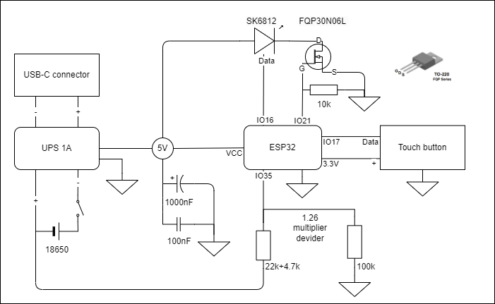
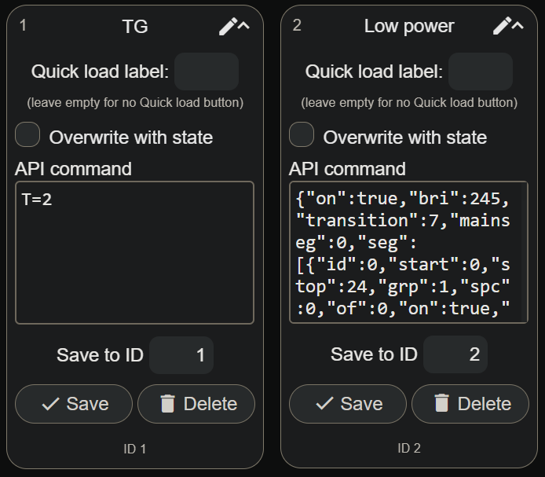
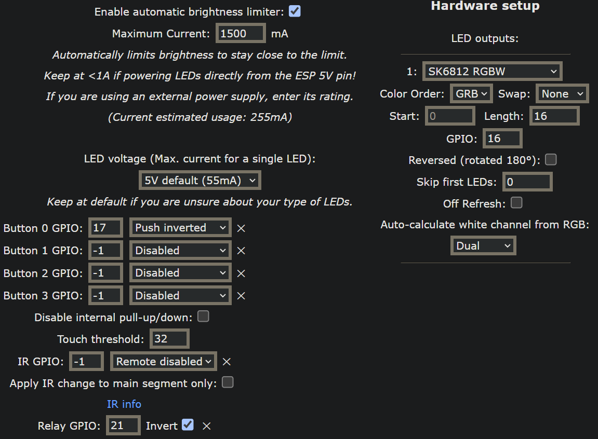
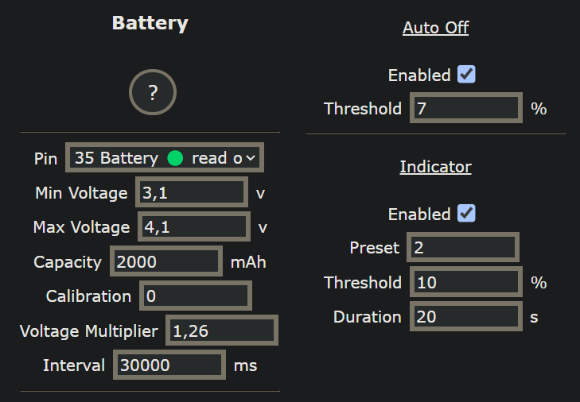

# TerarriumWled

Simple Wi-Fi controlled RGBW lightning for a terrarium. USB and battery powered.

# Simplified schematic

# BOM

This list of materials is just an example. You can use other parts if you want.

Part|Link|Price (avg)
:---|----|---:
UPS board 1A 5V|[Aliexpress](https://www.aliexpress.com/item/4000348420128.html)|1$
Wemos Mini D1 ESP-32S|[Aliexpress](https://www.aliexpress.com/item/32858054775.html)|4$
SK6812 LED ring|[Aliexpress](https://www.aliexpress.com/item/32846758306.html)|5.5$
TTP223 touch button module|[Aliexpress](https://www.aliexpress.com/item/4000540638639.html)|1$
USB-C socket|[Aliexpress](https://www.aliexpress.com/item/1005003412814152.html)|3$
Power slide switch 1A|[Aliexpress](https://www.aliexpress.com/item/1005004701747987.html)|4$ for 10
N-Channel MOSFET (FQP30N06)|[Datasheet](https://www.mouser.com/datasheet/2/308/fqp30n06-1192362.pdf). Can work with 3.3V logic without a level shifter|
18650 battery case|[Aliexpress](https://www.aliexpress.com/item/1005003042693819.html)|1$
Liitokala HG2 18650 3000mAh|[Aliexpress](https://www.aliexpress.com/item/32821524948.html)|10$
Capacitor 100nF|Ceramic 10+V 
Capacitor 1000nF|Electrolyte 10+V
Resistor 100k|Any kind
Resistor 22k|Any kind
Resistor 10k|Any kind
Resistor 4.7k|Any kind
Wires|AVG26 or thicker for power lines

# Wled

## Firmware

Wled is used as a firmware for controlling LED using Wi-Fi. You can find the source code of WLED MoonModules [here](https://github.com/MoonModules/WLED/tree/mdev). WLED is licensed under GNU General Public License v3.0. I don't provide the source code, because `.bin` is compiled from unmodified source code from the original repository with enabled [Battery usermod](https://mm.kno.wled.ge/usermods/Battery/). Your can get the compiled FW for ESP32 here (`WLEDMM_0.14.0-b25.29_esp32_16MB_M.bin`) or compile it yourself. All required information about configuring, compiling and tweaking can be found in [Wled wiki](https://mm.kno.wled.ge).

## Configuration

### Quick restore from backup

`wled_cfg_WLED_Terrarium.json` - configuration backup with LED, button, relay and battery settings.

`wled_presets_WLED_Terrarium.json` - presets backup. Presets for button (id=1), low battery (id=2) and some other presets selected by me.

### Settings example

If you don't want to use the backup, you can use these parameters:

**Presets**

**LED**

**Battery**

